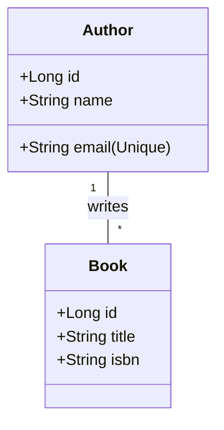

# Library Management System - Spring Boot & JSP

This project is a Spring Boot application designed to manage information for **Authors** and **Books**. It demonstrates the implementation of CRUD operations, JPA relationships, custom repository queries, and modern UI design using JSP and JSTL.

## 🚀 1. Entity Relationship Design

The system is built around two core entities with a **One-to-Many** relationship:
- **Author**: Represents a writer with a unique email and multiple books.
- **Book**: Represents a specific publication linked to an author.

### ER Diagram (Conceptual)


---

## 🛠️ 2. Implementation Details

### A. Populate Database
We use a `DataLoader` component that implements `CommandLineRunner`. This seeds the H2 database with **10 rows** for both Authors and Books automatically upon startup.

```java
// Seed data logic in DataLoader.java
for (int i = 1; i <= 10; i++) {
    Author author = Author.builder()
            .name("Author " + i)
            .email("author" + i + "@example.com")
            .build();
    libraryService.saveAuthor(author);
}
```

### B. Create Operation
Users can add new entities through dedicated JSP forms. The controller handles `POST` requests and catches **DataIntegrityViolationException** to prevent duplicate entries (e.g., same email).

**Mockup: Add Author Form**


### C. Read Operation
The application features a dashboard listing all entities. We also implemented a **Custom Query** in the `AuthorRepository` that performs an **Inner Join** to fetch authors who have published books.

```java
@Query("SELECT DISTINCT a FROM Author a INNER JOIN a.books b")
List<Author> findAuthorsWithBooks();
```

**Mockup: Dashboard View**


### D. Update Operation
Existing records can be modified. The controller binds existing data to the view model, ensuring that updates are applied correctly to the database via JPA's `save()` method.

---

## ⚡ 3. Challenges & Solutions

| Challenge | Solution |
|-----------|----------|
| **JSP Configuration** | Spring Boot 3+ requires specific `jakarta.servlet.jsp.jstl` dependencies and prefix/suffix properties. I configured these in `pom.xml` and `application.properties`. |
| **Integrity Violations** | Handling unique constraints (like duplicate emails) without crashing. I implemented `try-catch` blocks in the controller to return user-friendly error messages to the UI. |
| **Modern Aesthetics** | Standard JSP can look dated. I created a custom CSS design system using **Glassmorphism**, deep navy palettes, and the **Inter** font for a premium look. |

---

## 📦 4. How to Run

1.  **Clone the repository**.
2.  Ensure you have **JDK 17** and **Maven** installed.
3.  Open the terminal in the project root:
    ```bash
    mvn spring-boot:run
    ```
4.  Access the app at: `http://localhost:8080`

---

## 🔗 5. Github URL
[https://github.com/mr-panther01/BITS_SPRING_PROJECT](https://github.com/mr-panther01/BITS_SPRING_PROJECT)

---
*Created as part of the Spring Boot Development Assignment.*
